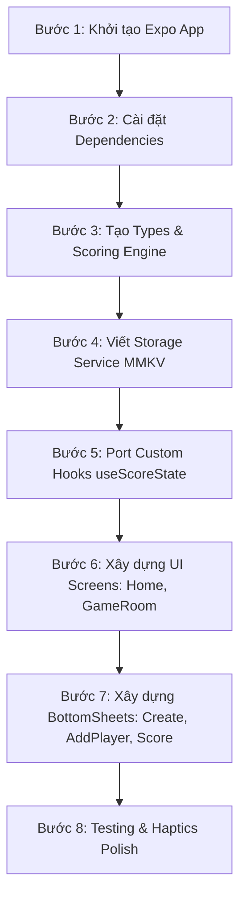

# HƯỚNG DẪN CHUYỂN ĐỔI TOÀN BỘ LOGIC SANG REACT NATIVE
> **Tác giả:** Senior React Native & Senior Frontend Developer  
> **Dự án nguồn:** Tiện Ích Đánh Bài (Ghi Điểm Tiến Lên)  
> **Mục tiêu:** Chuyển đổi 100% Core Business Logic, State Management, Data Layer và UI sang React Native (Expo / Bare CLI) với chuẩn Production-ready.

---

## MỤC LỤC
1. [Tổng Quan Kiến Trúc & Tech Stack Mapping](#1-tổng-quan-kiến-trúc--tech-stack-mapping)
2. [Thiết Kế Data Models & Types (TypeScript)](#2-thiết-kế-data-models--types-typescript)
3. [Tách Core Business Logic (Scoring Engine - Pure Functions)](#3-tách-core-business-logic-scoring-engine---pure-functions)
4. [Tầng Lưu Trữ (Storage Service - MMKV / AsyncStorage)](#4-tầng-lưu-trữ-storage-service---mmkv--asyncstorage)
5. [Custom Hooks & State Management (`useScoreState`)](#5-custom-hooks--state-management-usescorestate)
6. [Tái Cấu Trúc UI/UX trên Mobile (Gorhom Bottom Sheet & Native Components)](#6-tái-cấu-trúc-uiux-trên-mobile-gorhom-bottom-sheet--native-components)
7. [Checklist Các Bước Triển Khai Chi Tiết](#7-checklist-các-bước-triển-khai-chi-tiết)
8. [Code Mẫu Hoàn Chỉnh Các Module Cốt Lõi](#8-code-mẫu-hoàn-chỉnh-các-module-cốt-lõi)

---

## 1. TỔNG QUAN KIẾN TRÚC & TECH STACK MAPPING

| Thành phần Web (Hiện tại) | Giải pháp React Native (Đề xuất) | Lý do kỹ thuật |
| :--- | :--- | :--- |
| **Framework** | Expo SDK 52+ (hoặc Bare RN 0.76+) | Hỗ trợ New Architecture (TurboModules & Fabric), build nhanh, ổn định. |
| **Styling** | NativeWind v4 (TailwindCSS) hoặc StyleSheet | Giữ nguyên tư duy utility-classes, giao diện tối ưu dark mode. |
| **Routing / Navigation** | `@react-navigation/native` + `native-stack` | Hiệu năng native gesture transition mượt mà 120Hz. |
| **Drawer / Bottom Sheet** (`vaul`) | `@gorhom/bottom-sheet` | Chuẩn công nghiệp cho BottomSheet trong React Native, kéo thả 60-120fps trên UI thread (Reanimated). |
| **Local Storage** (`localStorage`) | `react-native-mmkv` | Nhanh hơn AsyncStorage gấp 30x, đọc/ghi đồng bộ (synchronous), không lo lag UI. |
| **Icons** (`lucide-react`) | `lucide-react-native` | Bộ icon tương đương 1:1, chạy native SVG qua `react-native-svg`. |
| **Safe Area & Viewport** (`useVisualViewport`) | `react-native-safe-area-context` + `KeyboardAvoidingView` | Xử lý tai thỏ, Dynamic Island, navigation bar Android và bàn phím native. |
| **Haptic Feedback** | `expo-haptics` | Tăng cảm giác sướng tay khi bấm chọn hạng, chặt đè, ghi điểm. |

---

## 2. THIẾT KẾ DATA MODELS & TYPES (TYPESCRIPT)

Đặt tại: `src/types/game.ts`

```typescript
export interface Player {
    id: string;
    name: string;
}

export type Rank = "NHẤT" | "NHÌ" | "BA" | "BÉT";

export interface GamePenalties {
    heoDo: number;       // Mặc định: 4
    heoDen: number;      // Mặc định: 2
    chetHeoDo: number;   // Mặc định: 2 (hoặc 4 tuỳ luật)
    chetHeoDen: number;  // Mặc định: 1 (hoặc 2 tuỳ luật)
    chetChay: number;    // Mặc định: 4
    doiThong?: number;   // Mặc định: 4
}

export interface GameSettings {
    nhat: number;        // Điểm về nhất (mặc định: 4 hoặc 3)
    nhi: number;         // Điểm về nhì (mặc định: 3 hoặc 2)
    ba: number;          // Điểm về ba (mặc định: 2 hoặc 1)
    bet: number;         // Điểm về bét (mặc định: 1 hoặc 0)
    penalties: GamePenalties;
}

export interface ChatEvent {
    id: string;
    heoDo: number;       // Số heo đỏ bị chặt
    heoDen: number;      // Số heo đen bị chặt
    doiThong: number;    // Số đôi thông
    sequence: string[];  // Danh sách ID người chơi tham gia: [pBiChat, pChat1, pChat2, ...]
}

export interface RoundDetail {
    ranks?: Record<string, Rank | null>;
    anHeoSelection?: Record<string, { do: number; den: number }>;
    phatHeoSelection?: Record<string, { do: number; den: number }>;
    chetHeoSelection?: Record<string, { do: number; den: number }>;
    chetChaySelection?: Record<string, "an" | "chay" | "">;
    chatEvents?: ChatEvent[];
}

export interface GameRound {
    scores: Record<string, number>; // { [playerId]: score }
    details?: RoundDetail;
}

export interface GameSession {
    id: string;
    time: string;
    players: Player[];
    history: GameRound[];
    settings: GameSettings;
}
```

---

## 3. TÁCH CORE BUSINESS LOGIC (SCORING ENGINE - PURE FUNCTIONS)

Để đảm bảo code clean, dễ kiểm thử (Unit Test) và không phụ thuộc vào React Component, tách toàn bộ thuật toán tính điểm ra một file riêng biệt.

Đặt tại: `src/logic/scoringEngine.ts`

```typescript
import { ChatEvent, GameSettings, Rank, RoundDetail } from "../types/game";

/**
 * 1. Tính điểm sự kiện Chặt Đè (Cut Stacking)
 * Quy tắc:
 * - basePoints = heoDo * valHeoDo + heoDen * valHeoDen
 * - Nếu 2 người (len = 2): Chặt đơn -> Người 0 bị trừ, Người 1 được cộng.
 * - Nếu >= 3 người (len >= 3): Chặt đè -> Người đầu tiên thoát phạt (0 điểm),
 *   Người bị chặt đè sau cùng (áp chót len-2) bị phạt gấp đôi theo luỹ thừa 2^(len-2).
 *   Người chặt đè sau cùng (len-1) được trọn vẹn số điểm đó.
 */
export function calculateEventScores(
    event: ChatEvent,
    heoValues: { do: number; den: number },
    _doiThongPenalty: number = 0
): Record<string, number> {
    const scores: Record<string, number> = {};
    const basePoints = (event.heoDo || 0) * heoValues.do + (event.heoDen || 0) * heoValues.den;

    if (basePoints <= 0 || event.sequence.length < 2) {
        return scores;
    }

    const len = event.sequence.length;

    if (len === 2) {
        const victim = event.sequence[0];
        const winner = event.sequence[1];
        if (victim) scores[victim] = (scores[victim] || 0) - basePoints;
        if (winner) scores[winner] = (scores[winner] || 0) + basePoints;
    } else {
        const multiplier = Math.pow(2, len - 2);
        const finalPoints = basePoints * multiplier;

        const victim = event.sequence[len - 2];
        const winner = event.sequence[len - 1];

        if (victim) scores[victim] = (scores[victim] || 0) - finalPoints;
        if (winner) scores[winner] = (scores[winner] || 0) + finalPoints;
    }

    return scores;
}

/**
 * 2. Lấy điểm thưởng theo thứ hạng về đích
 */
export function getScoreForRank(rank: Rank | null, settings?: GameSettings): number {
    if (!rank) return 0;
    const nhat = settings?.nhat ?? 3;
    const nhi = settings?.nhi ?? 2;
    const ba = settings?.ba ?? 1;
    const bet = settings?.bet ?? 0;

    switch (rank) {
        case "NHẤT": return nhat;
        case "NHÌ": return nhi;
        case "BA": return ba;
        case "BÉT": return bet;
        default: return 0;
    }
}

/**
 * 3. Tính tổng điểm của một người chơi trong 1 ván
 */
export function calculatePlayerScore(
    playerId: string,
    roundData: RoundDetail,
    settings: GameSettings,
    allPlayerIds: string[]
): number {
    let score = 0;
    const chetChay = roundData.chetChaySelection?.[playerId] || "";
    const isBurned = chetChay === "chay";
    const isEater = chetChay === "an";
    const chetChayPenalty = settings.penalties.chetChay ?? 4;

    // Số người bị cháy trong bàn
    const burnedCount = allPlayerIds.filter(
        (id) => roundData.chetChaySelection?.[id] === "chay"
    ).length;

    // A. Điểm thứ hạng hoặc phạt chết cháy
    if (isBurned) {
        score -= chetChayPenalty;
    } else {
        const rank = roundData.ranks?.[playerId] || null;
        score += getScoreForRank(rank, settings);
    }

    // B. Người ăn cháy: ăn toàn bộ tiền phạt của những người bị cháy
    if (isEater) {
        score += chetChayPenalty * burnedCount;
    }

    // C. Ăn Heo / Phạt Heo
    const heoValues = {
        do: settings.penalties.heoDo ?? 4,
        den: settings.penalties.heoDen ?? 2,
    };

    const anHeo = roundData.anHeoSelection?.[playerId];
    if (anHeo) {
        score += heoValues.do * (anHeo.do || 0);
        score += heoValues.den * (anHeo.den || 0);
    }

    const phatHeo = roundData.phatHeoSelection?.[playerId];
    if (phatHeo) {
        score -= heoValues.do * (phatHeo.do || 0);
        score -= heoValues.den * (phatHeo.den || 0);
    }

    // D. Chết Heo (Thối heo khi kết thúc ván)
    const chetHeoValues = {
        do: settings.penalties.chetHeoDo ?? 2,
        den: settings.penalties.chetHeoDen ?? 1,
    };
    const chetHeo = roundData.chetHeoSelection?.[playerId];
    if (chetHeo) {
        score -= chetHeoValues.do * (chetHeo.do || 0);
        score -= chetHeoValues.den * (chetHeo.den || 0);
    }

    // E. Chặt Đè (Cut Stacking)
    const dtValue = settings.penalties.doiThong ?? 4;
    (roundData.chatEvents || []).forEach((ev) => {
        const evScores = calculateEventScores(ev, heoValues, dtValue);
        score += evScores[playerId] || 0;
    });

    return score;
}

/**
 * 4. Kiểm tra ván đấu đã hợp lệ để lưu chưa
 * Điều kiện: Tất cả người chơi KHÔNG BỊ CHÁY đều phải được xếp hạng
 */
export function isRoundValidToSave(
    playerIds: string[],
    ranks: Record<string, Rank | null>,
    chetChaySelection: Record<string, "an" | "chay" | "">
): boolean {
    const activePlayerIds = playerIds.filter(
        (id) => chetChaySelection[id] !== "chay"
    );
    if (activePlayerIds.length === 0) return false;
    return activePlayerIds.every((id) => Boolean(ranks[id]));
}
```

---

## 4. TẦNG LƯU TRỮ (STORAGE SERVICE - MMKV / ASYNCSTORAGE)

Thay thế hoàn toàn `localStorage.getItem("game_history")` bằng Storage Adapter.

Đặt tại: `src/services/storage.ts`

```typescript
import { MMKV } from "react-native-mmkv";
import { GameSession } from "../types/game";

const storage = new MMKV();
const GAME_HISTORY_KEY = "game_history";

export const GameStorage = {
    getAllGames(): GameSession[] {
        try {
            const raw = storage.getString(GAME_HISTORY_KEY);
            if (!raw) return [];
            const games = JSON.parse(raw);
            // Chuẩn hoá phòng trường hợp phiên bản cũ player chỉ lưu string name
            return games.map((g: any) => ({
                ...g,
                players: (g.players || []).map((p: any) =>
                    typeof p === "string" ? { id: p, name: p } : p
                ),
            }));
        } catch (error) {
            console.error("Lỗi đọc game history:", error);
            return [];
        }
    },

    getGameById(id: string): GameSession | null {
        const games = this.getAllGames();
        return games.find((g) => g.id === id) || null;
    },

    saveAllGames(games: GameSession[]): void {
        try {
            storage.set(GAME_HISTORY_KEY, JSON.stringify(games));
        } catch (error) {
            console.error("Lỗi lưu game history:", error);
        }
    },

    saveGame(game: GameSession): void {
        const games = this.getAllGames();
        const index = games.findIndex((g) => g.id === game.id);
        if (index >= 0) {
            games[index] = game;
        } else {
            games.unshift(game);
        }
        this.saveAllGames(games);
    },

    deleteGame(id: string): void {
        const games = this.getAllGames().filter((g) => g.id !== id);
        this.saveAllGames(games);
    },
};
```
*(Nếu dùng Expo Go và không thể build native MMKV, chỉ cần thay `storage.getString` thành `AsyncStorage.getItem` dạng async).*

---

## 5. CUSTOM HOOKS & STATE MANAGEMENT (`useScoreState`)

Hook chuyển đổi 1:1 từ web sang React Native, tích hợp với `scoringEngine`.

Đặt tại: `src/hooks/useScoreState.ts`

```typescript
import { useState, useMemo } from "react";
import { Player, Rank, ChatEvent, RoundDetail, GameSettings } from "../types/game";
import {
    calculatePlayerScore,
    isRoundValidToSave,
    calculateEventScores,
} from "../logic/scoringEngine";

interface UseScoreStateProps {
    players: Player[];
    settings: GameSettings;
    initialData?: RoundDetail;
    onConfirm: (scores: Record<string, number>, details: RoundDetail) => void;
}

export function useScoreState({
    players,
    settings,
    initialData,
    onConfirm,
}: UseScoreStateProps) {
    const [ranks, setRanks] = useState<Record<string, Rank | null>>(
        initialData?.ranks || {}
    );
    const [activeTab, setActiveTab] = useState<string>("ĂN PHẠT HEO");
    const [anHeoSelection, setAnHeoSelection] = useState<
        Record<string, { do: number; den: number }>
    >(initialData?.anHeoSelection || {});
    const [phatHeoSelection, setPhatHeoSelection] = useState<
        Record<string, { do: number; den: number }>
    >(initialData?.phatHeoSelection || {});
    const [chetHeoSelection, setChetHeoSelection] = useState<
        Record<string, { do: number; den: number }>
    >(initialData?.chetHeoSelection || {});
    const [chetChaySelection, setChetChaySelection] = useState<
        Record<string, "an" | "chay" | "">
    >(initialData?.chetChaySelection || {});
    const [chatEvents, setChatEvents] = useState<ChatEvent[]>(
        initialData?.chatEvents || []
    );

    const isPlayerBurned = (id: string) => chetChaySelection[id] === "chay";
    const isPlayerEater = (id: string) => chetChaySelection[id] === "an";
    const burnedCount = useMemo(
        () => players.filter((p) => isPlayerBurned(p.id)).length,
        [players, chetChaySelection]
    );

    // Xếp hạng: Nhấp vào người chơi để gán thứ tự tiếp theo
    const handlePlayerRankClick = (id: string) => {
        if (isPlayerBurned(id)) return;

        const rankOrder: Rank[] = ["NHẤT", "NHÌ", "BA", "BÉT"];
        if (ranks[id]) {
            const next = { ...ranks };
            delete next[id];
            setRanks(next);
        } else {
            const assigned = Object.values(ranks).filter(Boolean) as Rank[];
            const nextAvailable = rankOrder.find((r) => !assigned.includes(r));
            if (nextAvailable) {
                setRanks({ ...ranks, [id]: nextAvailable });
            }
        }
    };

    // Toggle heo: 0 -> 1 -> 2 -> 0
    const toggleHeo = (
        id: string,
        color: "do" | "den",
        type: "an" | "phat" | "chet"
    ) => {
        const selectionMap = {
            an: [anHeoSelection, setAnHeoSelection] as const,
            phat: [phatHeoSelection, setPhatHeoSelection] as const,
            chet: [chetHeoSelection, setChetHeoSelection] as const,
        };
        const [targetSelection, setTargetSelection] = selectionMap[type];
        const current = targetSelection[id] || { do: 0, den: 0 };
        const currentVal = current[color];
        const nextVal = currentVal === 0 ? 1 : currentVal === 1 ? 2 : 0;

        setTargetSelection({
            ...targetSelection,
            [id]: { ...current, [color]: nextVal },
        });
    };

    const clearHeo = (id: string, type: "an" | "phat" | "chet") => {
        if (type === "an") setAnHeoSelection({ ...anHeoSelection, [id]: { do: 0, den: 0 } });
        if (type === "phat") setPhatHeoSelection({ ...phatHeoSelection, [id]: { do: 0, den: 0 } });
        if (type === "chet") setChetHeoSelection({ ...chetHeoSelection, [id]: { do: 0, den: 0 } });
    };

    const clearChetChay = (id: string) => {
        setChetChaySelection({ ...chetChaySelection, [id]: "" });
    };

    // Chặt đè
    const addChatEvent = () => {
        const defaultSeq = players.length >= 2 ? [players[0].id, players[1].id] : [];
        setChatEvents([
            ...chatEvents,
            {
                id: Date.now().toString() + Math.random().toString(36).substring(2, 6),
                heoDo: 0,
                heoDen: 0,
                doiThong: 1,
                sequence: defaultSeq,
            },
        ]);
    };

    const updateChatEvent = (updated: ChatEvent) => {
        setChatEvents(chatEvents.map((ev) => (ev.id === updated.id ? updated : ev)));
    };

    const removeChatEvent = (id: string) => {
        setChatEvents(chatEvents.filter((ev) => ev.id !== id));
    };

    // Điểm của người chơi hiện tại
    const getScore = (id: string) => {
        const roundData: RoundDetail = {
            ranks,
            anHeoSelection,
            phatHeoSelection,
            chetHeoSelection,
            chetChaySelection,
            chatEvents,
        };
        return calculatePlayerScore(
            id,
            roundData,
            settings,
            players.map((p) => p.id)
        );
    };

    const allRanked = useMemo(
        () => isRoundValidToSave(players.map((p) => p.id), ranks, chetChaySelection),
        [players, ranks, chetChaySelection]
    );

    const handleConfirm = () => {
        if (!allRanked) return;
        const scores: Record<string, number> = {};
        players.forEach((p) => {
            scores[p.id] = getScore(p.id);
        });

        const details: RoundDetail = {
            ranks,
            anHeoSelection,
            phatHeoSelection,
            chetHeoSelection,
            chetChaySelection,
            chatEvents,
        };

        onConfirm(scores, details);
    };

    return {
        ranks,
        setRanks,
        activeTab,
        setActiveTab,
        anHeoSelection,
        phatHeoSelection,
        chetHeoSelection,
        chetChaySelection,
        setChetChaySelection,
        chatEvents,
        addChatEvent,
        updateChatEvent,
        removeChatEvent,
        isPlayerBurned,
        isPlayerEater,
        burnedCount,
        handlePlayerRankClick,
        toggleHeo,
        clearHeo,
        clearChetChay,
        getScore,
        allRanked,
        handleConfirm,
    };
}
```

---

## 6. TÁI CẤU TRÚC UI/UX TRÊN MOBILE (GORHOM BOTTOM SHEET & NATIVE COMPONENTS)

### 6.1. Drawer Web ➡️ BottomSheet React Native
Trên Web bạn dùng `vaul` (`Drawer`). Trên React Native, hãy dùng `@gorhom/bottom-sheet` để đạt hiệu năng kéo trượt 120 FPS như app iOS native:

```tsx
import React, { useRef, useMemo, useCallback } from "react";
import BottomSheet, { BottomSheetView, BottomSheetBackdrop } from "@gorhom/bottom-sheet";

export function ScoreBottomSheet({ isOpen, onClose, children }) {
    const bottomSheetRef = useRef<BottomSheet>(null);
    const snapPoints = useMemo(() => ["85%", "92%"], []);

    const renderBackdrop = useCallback(
        (props: any) => (
            <BottomSheetBackdrop {...props} disappearsOnIndex={-1} appearsOnIndex={0} opacity={0.7} />
        ),
        []
    );

    if (!isOpen) return null;

    return (
        <BottomSheet
            ref={bottomSheetRef}
            snapPoints={snapPoints}
            enablePanDownToClose
            onClose={onClose}
            backdropComponent={renderBackdrop}
            backgroundStyle={{ backgroundColor: "#0a0a0a" }}
            handleIndicatorStyle={{ backgroundColor: "#333" }}
        >
            <BottomSheetView style={{ flex: 1 }}>
                {children}
            </BottomSheetView>
        </BottomSheet>
    );
}
```

### 6.2. Thay thế `useVisualViewport`
Web dùng `useVisualViewport` để đẩy bottom button khi bàn phím xuất hiện. Trong React Native:
```tsx
import { KeyboardAvoidingView, Platform } from "react-native";
import { useSafeAreaInsets } from "react-native-safe-area-context";

export function ScreenContainer({ children }) {
    const insets = useSafeAreaInsets();
    return (
        <KeyboardAvoidingView
            behavior={Platform.OS === "ios" ? "padding" : "height"}
            style={{ flex: 1, backgroundColor: "#000000", paddingBottom: insets.bottom }}
        >
            {children}
        </KeyboardAvoidingView>
    );
}
```

---

## 7. CHECKLIST CÁC BƯỚC TRIỂN KHAI CHI TIẾT



### Bước 1: Khởi tạo Dự Án (Expo SDK 52)
```bash
npx create-expo-app@latest TienIchDanhBai --template blank-typescript
cd TienIchDanhBai
```

### Bước 2: Cài Đặt Thư Viện Cần Thiết
```bash
npx expo install @react-navigation/native @react-navigation/native-stack react-native-screens react-native-safe-area-context
npx expo install @gorhom/bottom-sheet react-native-gesture-handler react-native-reanimated
npx expo install react-native-mmkv
npx expo install lucide-react-native react-native-svg
npx expo install expo-haptics
```

*Cấu hình `babel.config.js`: Thêm plugin `react-native-reanimated/plugin` ở cuối danh sách.*

---

## 8. CODE MẪU HOÀN CHỈNH CÁC MODULE CỐT LÕI

### 8.1. `GameRoomScreen.tsx` (Màn hình chính bàn chơi)

```tsx
import React, { useState, useEffect } from "react";
import {
    View,
    Text,
    TouchableOpacity,
    FlatList,
    StyleSheet,
    Alert,
} from "react-native";
import { useSafeAreaInsets } from "react-native-safe-area-context";
import { ArrowLeft, Flag, RotateCcw, Plus, UserPlus } from "lucide-react-native";
import * as Haptics from "expo-haptics";
import { GameStorage } from "../services/storage";
import { GameSession, Player, RoundDetail } from "../types/game";

export default function GameRoomScreen({ route, navigation }: any) {
    const { gameId } = route.params;
    const insets = useSafeAreaInsets();

    const [game, setGame] = useState<GameSession | null>(() =>
        GameStorage.getGameById(gameId)
    );
    const [isScoreSheetOpen, setIsScoreSheetOpen] = useState(false);
    const [editingIndex, setEditingIndex] = useState<number | null>(null);

    if (!game) {
        return (
            <View style={[styles.container, { paddingTop: insets.top }]}>
                <Text style={styles.errorText}>Không tìm thấy bàn chơi</Text>
            </View>
        );
    }

    const { players, history, settings } = game;
    const roundCount = history.length;

    // Lưu lại khi game thay đổi
    const updateGame = (updated: GameSession) => {
        setGame(updated);
        GameStorage.saveGame(updated);
    };

    const handleConfirmScore = (scores: Record<string, number>, details: RoundDetail) => {
        Haptics.notificationAsync(Haptics.NotificationFeedbackType.Success);
        let newHistory = [...game.history];
        if (editingIndex !== null) {
            newHistory[editingIndex] = { scores, details };
        } else {
            newHistory.push({ scores, details });
        }
        updateGame({ ...game, history: newHistory });
        setIsScoreSheetOpen(false);
        setEditingIndex(null);
    };

    const handleReset = () => {
        Alert.alert(
            "Làm mới ván chơi?",
            "Hành động này sẽ xóa toàn bộ lịch sử điểm số của bàn đấu này.",
            [
                { text: "Hủy", style: "cancel" },
                {
                    text: "Làm mới",
                    style: "destructive",
                    onPress: () => {
                        updateGame({ ...game, history: [] });
                        Haptics.impactAsync(Haptics.ImpactFeedbackStyle.Medium);
                    },
                },
            ]
        );
    };

    return (
        <View style={[styles.container, { paddingTop: insets.top }]}>
            {/* Header */}
            <View style={styles.header}>
                <TouchableOpacity
                    onPress={() => navigation.goBack()}
                    style={styles.circleBtn}
                >
                    <ArrowLeft color="#9ca3af" size={20} />
                </TouchableOpacity>

                <View style={styles.headerTitle}>
                    <Text style={styles.timeText}>{game.time}</Text>
                    <Text style={styles.subText}>TỔNG {roundCount} VÁN</Text>
                </View>

                <View style={styles.headerActions}>
                    <TouchableOpacity onPress={handleReset} style={styles.actionBtn}>
                        <RotateCcw color="#9ca3af" size={18} />
                    </TouchableOpacity>
                </View>
            </View>

            {/* Player Grid Header */}
            {players.length > 0 && (
                <View style={styles.playerHeaderRow}>
                    <View style={{ width: 36 }} />
                    <View style={styles.playersRow}>
                        {players.map((p) => (
                            <View key={p.id} style={styles.playerCard}>
                                <Text style={styles.playerName} numberOfLines={1}>
                                    {p.name}
                                </Text>
                            </View>
                        ))}
                    </View>
                </View>
            )}

            {/* Round History List */}
            <FlatList
                data={[...history].reverse()}
                keyExtractor={(_, i) => (history.length - 1 - i).toString()}
                contentContainerStyle={{ paddingBottom: 100 }}
                renderItem={({ item, index }) => {
                    const originalIdx = history.length - 1 - index;
                    return (
                        <TouchableOpacity
                            onPress={() => {
                                setEditingIndex(originalIdx);
                                setIsScoreSheetOpen(true);
                            }}
                            style={styles.roundRow}
                        >
                            <Text style={styles.roundNum}>{originalIdx + 1}</Text>
                            <View style={styles.playersRow}>
                                {players.map((p) => {
                                    const score = item.scores[p.id] ?? 0;
                                    const isPos = score > 0;
                                    const isNeg = score < 0;
                                    return (
                                        <View key={p.id} style={styles.scoreCell}>
                                            <Text
                                                style={[
                                                    styles.scoreText,
                                                    isPos && styles.posScore,
                                                    isNeg && styles.negScore,
                                                ]}
                                            >
                                                {isPos ? `+${score}` : score}
                                            </Text>
                                        </View>
                                    );
                                })}
                            </View>
                        </TouchableOpacity>
                    );
                }}
            />

            {/* Bottom Action Bar */}
            <View style={[styles.bottomBar, { paddingBottom: insets.bottom + 12 }]}>
                <TouchableOpacity
                    onPress={() => {
                        setEditingIndex(null);
                        setIsScoreSheetOpen(true);
                    }}
                    style={styles.recordBtn}
                >
                    <Plus color="#ffffff" size={24} />
                    <Text style={styles.recordBtnText}>GHI ĐIỂM</Text>
                </TouchableOpacity>
            </View>
        </View>
    );
}

const styles = StyleSheet.create({
    container: { flex: 1, backgroundColor: "#000000" },
    errorText: { color: "#ffffff", textAlign: "center", marginTop: 40 },
    header: {
        flexDirection: "row",
        alignItems: "center",
        justifyContent: "space-between",
        paddingHorizontal: 16,
        paddingVertical: 12,
        borderBottomWidth: 1,
        borderColor: "rgba(255,255,255,0.06)",
    },
    circleBtn: {
        width: 40,
        height: 40,
        borderRadius: 20,
        backgroundColor: "#1c1c1e",
        justifyContent: "center",
        alignItems: "center",
    },
    headerTitle: { alignItems: "center" },
    timeText: { color: "#ffffff", fontWeight: "bold", fontSize: 14 },
    subText: { color: "#10b981", fontSize: 10, fontWeight: "bold", marginTop: 2 },
    headerActions: { flexDirection: "row", gap: 8 },
    actionBtn: {
        width: 36,
        height: 36,
        borderRadius: 10,
        backgroundColor: "#1c1c1e",
        justifyContent: "center",
        alignItems: "center",
    },
    playerHeaderRow: {
        flexDirection: "row",
        alignItems: "center",
        paddingVertical: 12,
        paddingHorizontal: 16,
        borderBottomWidth: 1,
        borderColor: "rgba(255,255,255,0.06)",
    },
    playersRow: { flex: 1, flexDirection: "row", gap: 8 },
    playerCard: {
        flex: 1,
        backgroundColor: "#151517",
        borderRadius: 10,
        paddingVertical: 8,
        alignItems: "center",
        borderWidth: 1,
        borderColor: "rgba(255,255,255,0.08)",
    },
    playerName: { color: "#e5e7eb", fontWeight: "bold", fontSize: 13, textTransform: "uppercase" },
    roundRow: {
        flexDirection: "row",
        alignItems: "center",
        paddingVertical: 14,
        paddingHorizontal: 16,
        borderBottomWidth: 1,
        borderColor: "rgba(255,255,255,0.04)",
    },
    roundNum: { width: 36, color: "#6b7280", fontWeight: "bold", fontSize: 14 },
    scoreCell: { flex: 1, alignItems: "center" },
    scoreText: { fontSize: 16, fontWeight: "bold", color: "#9ca3af" },
    posScore: { color: "#10b981" },
    negScore: { color: "#ef4444" },
    bottomBar: {
        position: "absolute",
        bottom: 0,
        left: 0,
        right: 0,
        backgroundColor: "rgba(10,10,10,0.95)",
        borderTopWidth: 1,
        borderColor: "rgba(255,255,255,0.06)",
        paddingHorizontal: 16,
        paddingTop: 12,
    },
    recordBtn: {
        height: 54,
        borderRadius: 16,
        backgroundColor: "#dc2626",
        flexDirection: "row",
        justifyContent: "center",
        alignItems: "center",
        gap: 8,
        shadowColor: "#ef4444",
        shadowOffset: { width: 0, height: 4 },
        shadowOpacity: 0.3,
        shadowRadius: 10,
        elevation: 6,
    },
    recordBtnText: { color: "#ffffff", fontWeight: "bold", fontSize: 16, letterSpacing: 1 },
});
```

---

## 9. LỜI KHUYÊN TỪ SENIOR VỀ PERFORMANCE & TRẢI NGHIỆM

1. **Hiệu Năng Render Danh Sách Điểm:**
   - Khi bàn chơi kéo dài tới hàng chục ván (30-50 ván), `FlatList` với `getItemLayout` hoặc thư viện `@shopify/flash-list` sẽ giữ FPS ổn định 60fps mượt mà không hao pin.
2. **Trải Nghiệm Cảm Ứng (Haptics):**
   - Luôn kích hoạt `Haptics.impactAsync(Haptics.ImpactFeedbackStyle.Light)` khi người dùng toggle Heo đỏ/đen hoặc chọn thứ tự Nhất/Nhì/Ba/Bét. Điều này tạo cảm giác phản hồi cơ học như đang chơi cờ bạc trực tiếp.
3. **Quản Lý Bàn Phím Tránh Vỡ Giao Diện:**
   - Trong màn hình Tạo Ván (`CreateGame`) và Thêm Người Chơi (`AddPlayer`), luôn bọc `ScrollView` kèm `keyboardShouldPersistTaps="handled"`.
4. **Offline First:**
   - Ứng dụng này hoạt động 100% offline. `react-native-mmkv` đảm bảo không bao giờ bị mất dữ liệu ngay cả khi ứng dụng bị force kill đột ngột.
